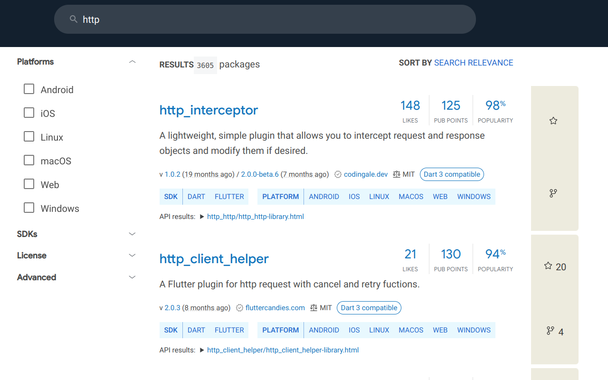

# Package Hunter
A browser extension to help programmers find different programming language packages more effectively by adding Github star and fork count to search results.

# [Add to Chrome](https://chrome.google.com/webstore/detail/package-hunter/fkbbiniadlppgncanioiajphnlbickni)

# Supported Packages Host
- [x] [pypi](https://pypi.org/)
- [x] [crates.io](https://crates.io/)
- [x] [npmjs](https://www.npmjs.com/)
- [x] [pub.dev](https://pub.dev/)

## Screenshots
#### Python Pypi

#### Rust Crate

#### Javascript Npm

#### Dart Pub

