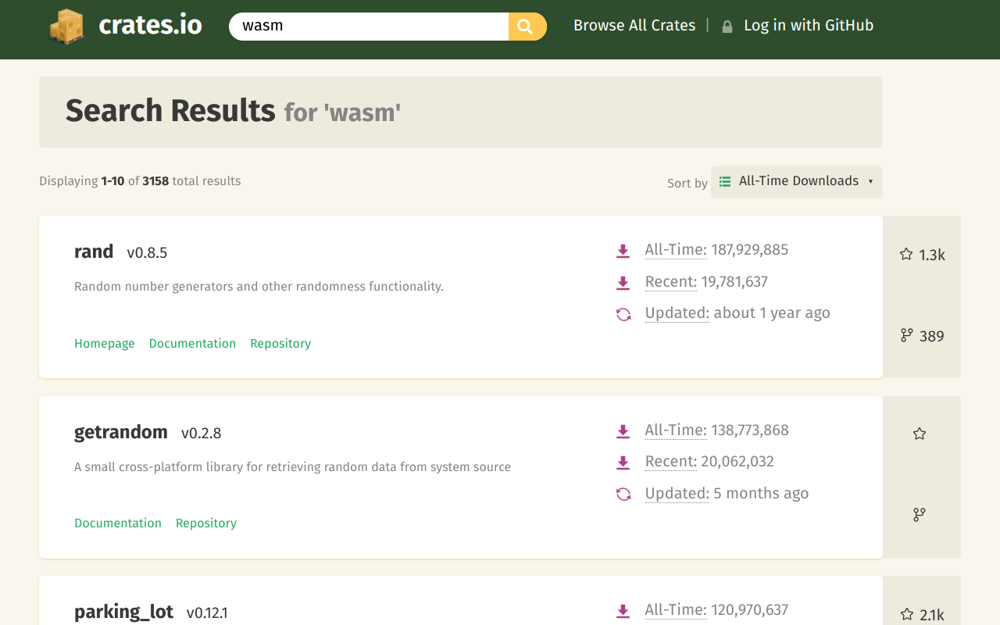

# Package Hunter
A browser extension to help programmer find different programming language packages effectively.

# Supported Packages Host
- [x] [pypi](https://pypi.org/)
- [x] [crates.io](https://crates.io/)
- [ ] [npmjs](https://www.npmjs.com/)

# [Plugin URL](https://chrome.google.com/webstore/detail/package-hunter/fkbbiniadlppgncanioiajphnlbickni)
## Screenshots

